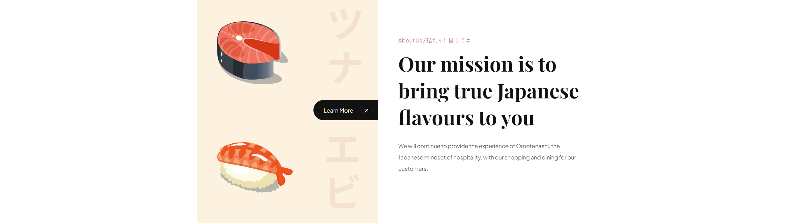

# Javascript Sushi Website

    
    
    

This program builds a responsive, animated website for a sushi restaurant in HTML, CSS & JavaScript.

Using a design from Hakim Haiman found here: https://dribbble.com/shots/18600292-Sushiman-Food-Landing-Pages

This has been built into a web application accessible here: https://sommos.github.io/javascript_sushi_website

This has also been built into a Flutter app, version is accessible here: https://github.com/Sommos/flutter_sushi_restaurant

# Contribution

If you'd like to contribute to `javascript_sushi_website` please submit a pull-request on a feature branch.

# Installing

Clone the repo:

    git clone https://github.com/Sommos/javascript_sushi_website
    cd javascript_sushi_website
